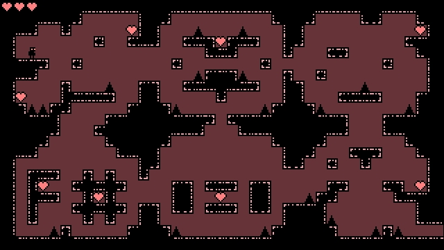

# Platformer Demo



This demo uses [Garnet](https://github.com/bcarruthers/garnet) and its sample toolkit to implement a simple platformer in F#. Keep in mind it's taken from game jam code, so it's not necessarily well-organized or complete.

Run ```build.cmd``` to build and package.

Asset workflow:

1. Add or modify assets in the ```assets``` folder
2. Run ```pack-assets.cmd``` to create ```assets.dat```
3. Platformer.fsproj references ```assets.dat```

You can also just include the assets folder as-is in the published output folder.

For simplicity, Paket is omitted, but by using it you can reduce the published build size by a few megabytes.